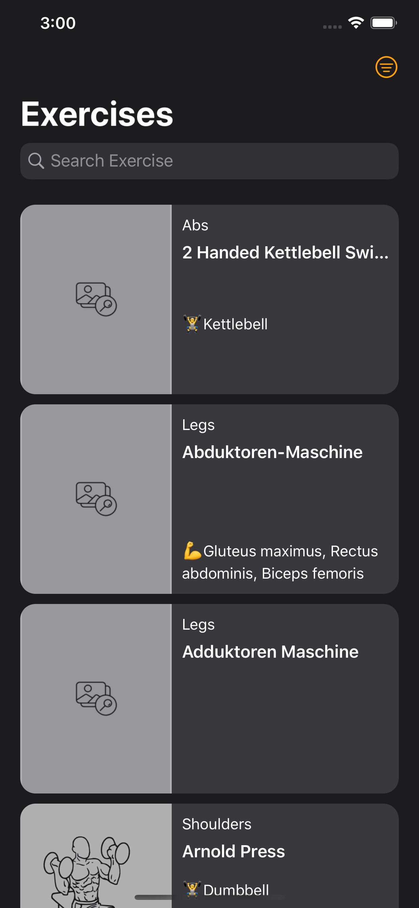

# Exercise App

 iOS Application implementing the user stories that follow.
## Installing
1. Run `pod install`
2. Open `Exercises.xcworkspace`
3. Run the project
## Screenshots
**User Story #1: List of Exercises : As a user, I want to see a paginated list of exercises.**

```

```

**User Story #2: Exercise Detail : As a user, I want to be able to tap on an exercise in the list and open a detailed view.**

**User Story #3: Search : As a user, I want to be able to search in the list of exercises.**

**User Story #4 - Filter : As a user, I want to be able to filter exercises by body part.**

**User Story #5 - UI Feedback: As a user, I want to get feedback when the UI is loading**